# Project 04: Movie Data Analysis
Author: Juliho Castillo Colmenares

### Exercise 1

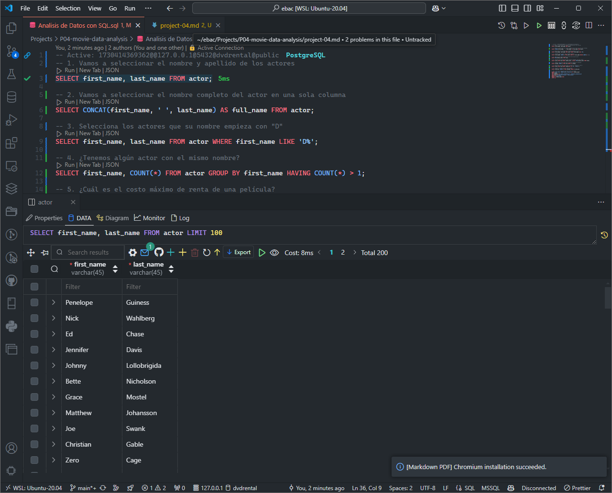

### Exercise 2

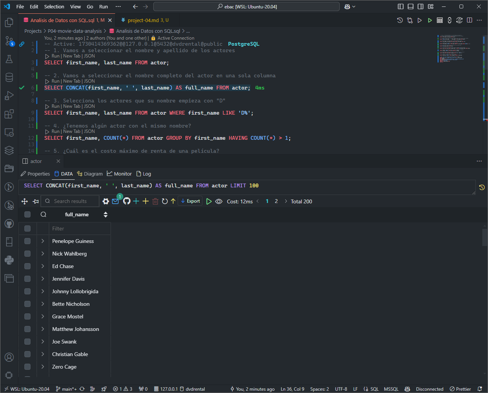

### Exercise 3

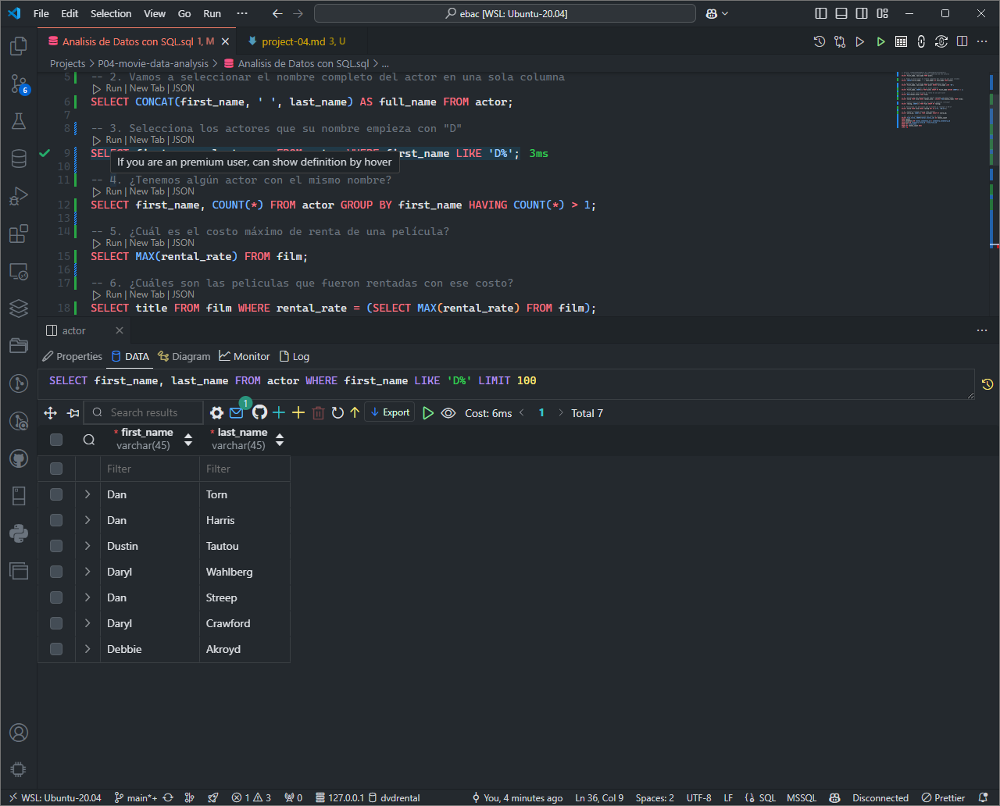

### Exercise 4

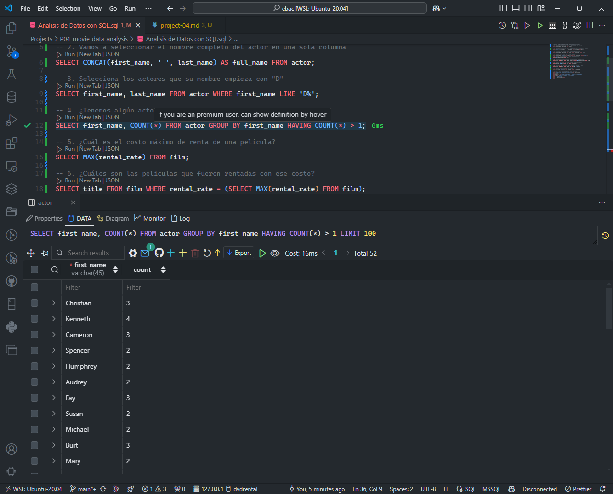

### Exercise 5

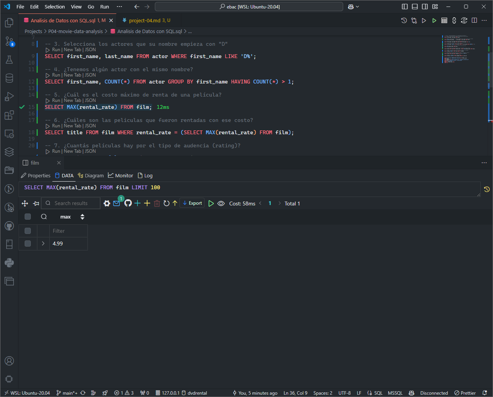

### Exercise 6

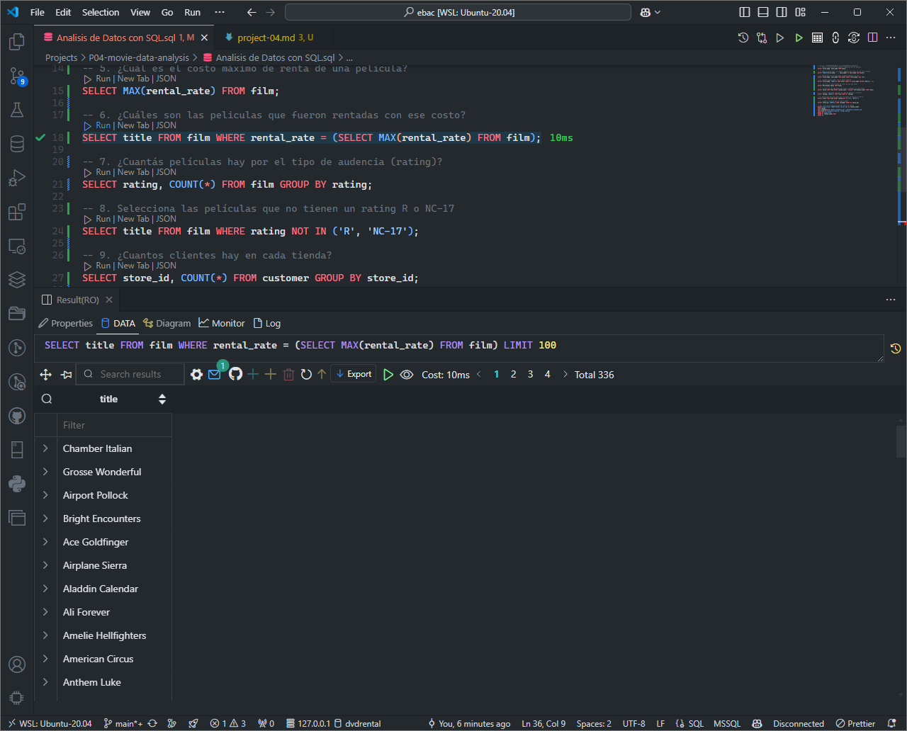

### Exercise 7

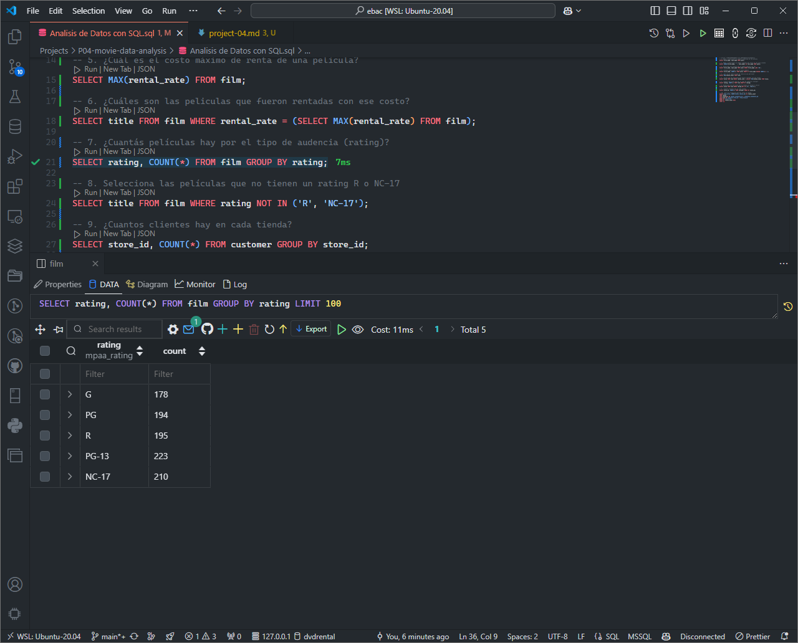

### Exercise 8

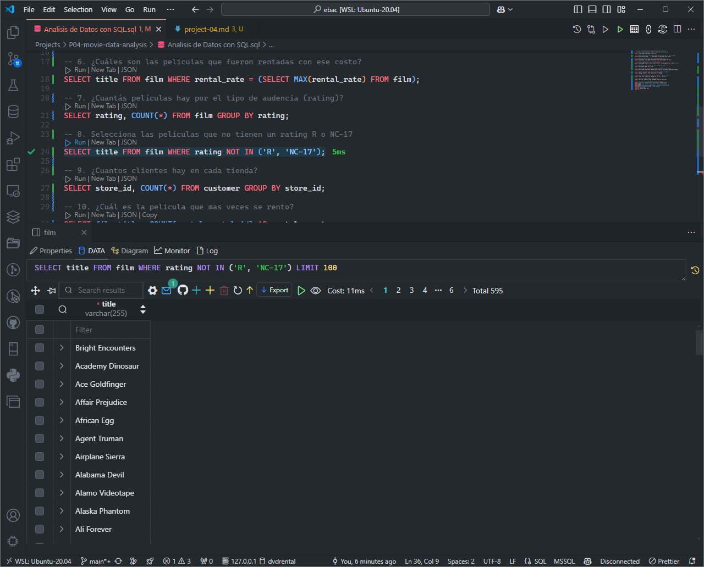

### Exercise 9

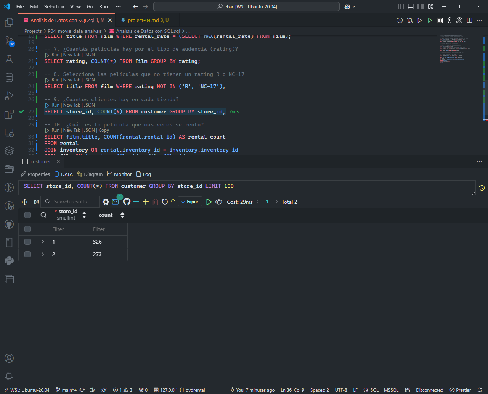

### Exercise 10

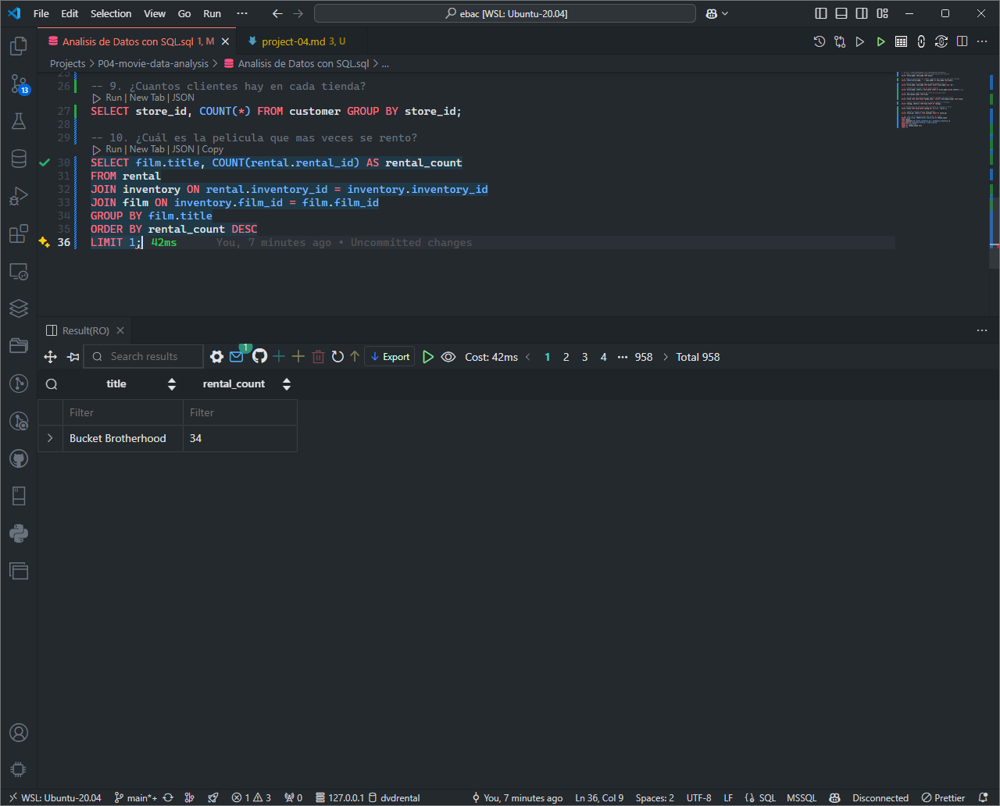

### Exercise 11

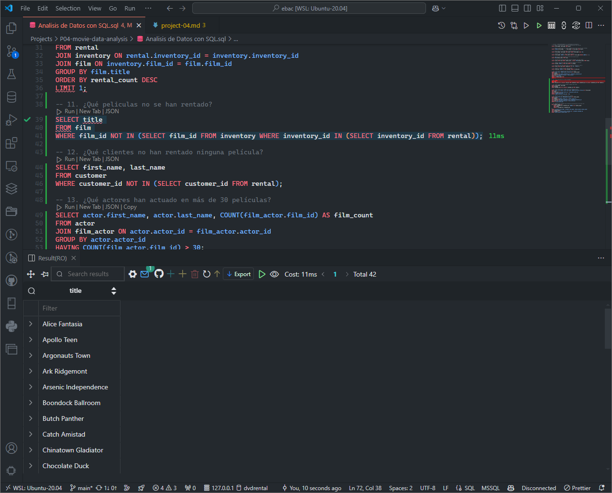

### Exercise 12

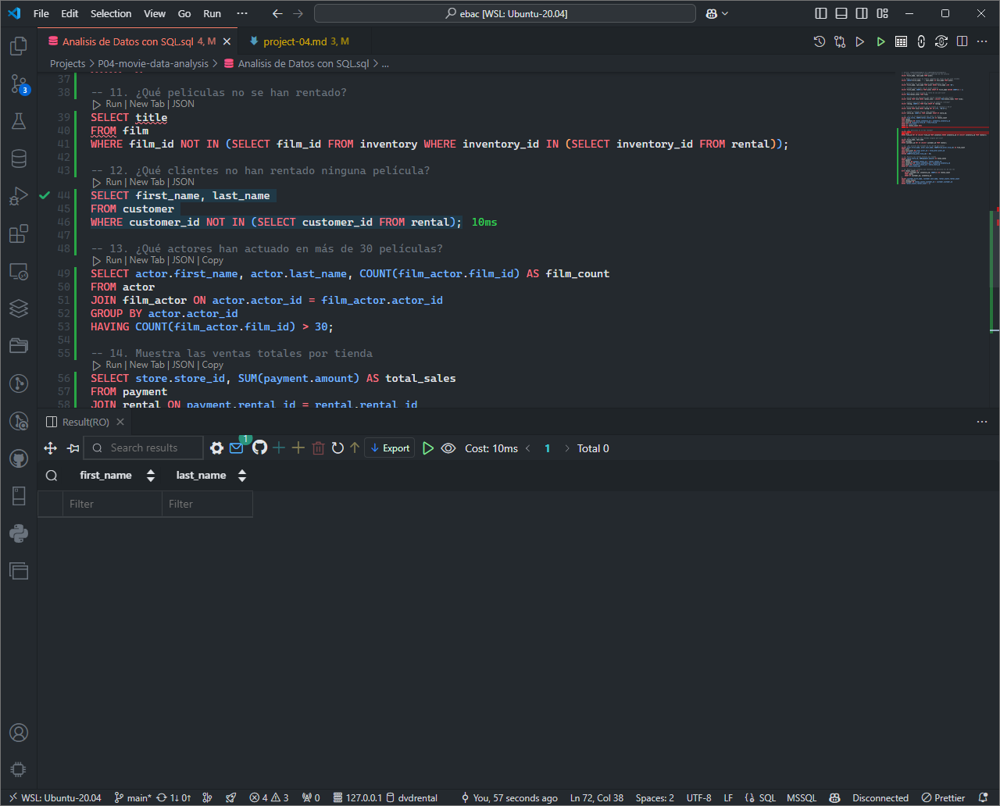

### Exercise 13

### Exercise 14

### Exercise 15

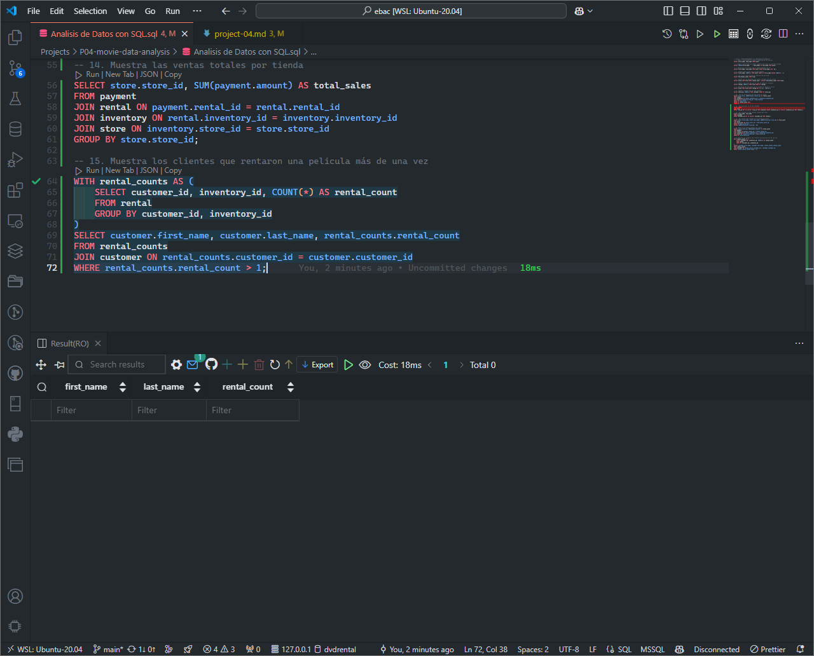