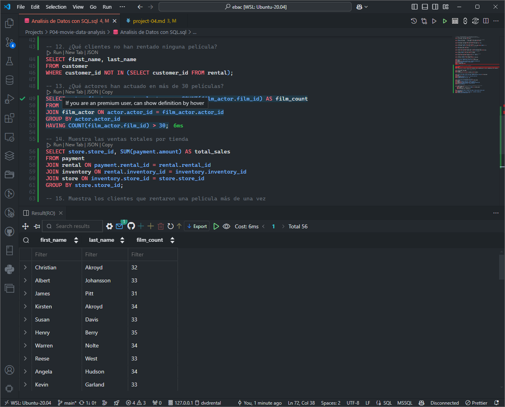
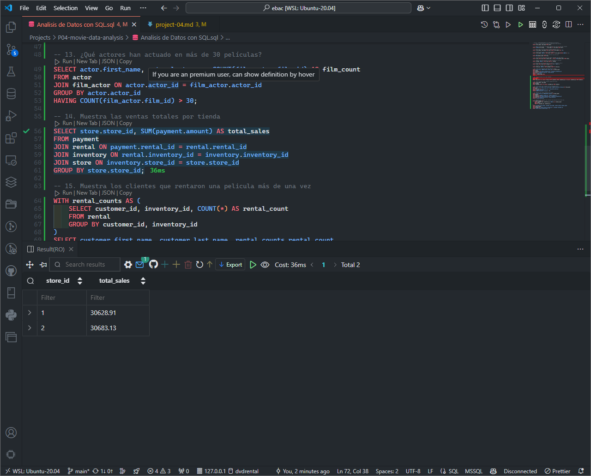

# Project 04: Movie Data Analysis
Author: Juliho Castillo Colmenares

### Exercise 1

### Exercise 2

### Exercise 3

### Exercise 4

### Exercise 5

### Exercise 6

### Exercise 7

### Exercise 8

### Exercise 9

### Exercise 10

### Exercise 11

### Exercise 12

### Exercise 13

### Exercise 14

### Exercise 15

