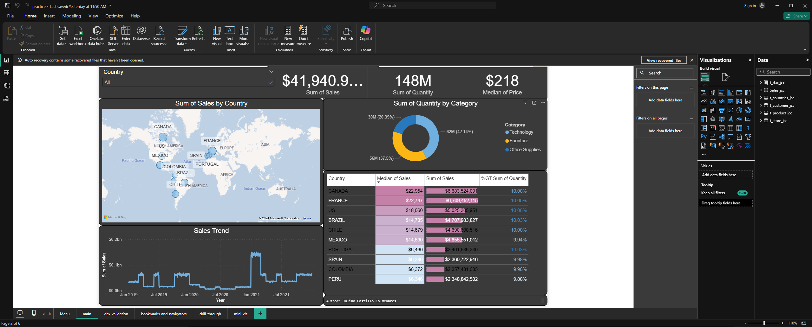

# EBAC Data Scientist Program

This repository contains the projects and exercises developed during the EBAC Data Scientist Program.

Author: Juliho Castillo Colmenares

- [LinkedIn](https://www.linkedin.com/in/julihocc/)
- [Kaggle](https://www.kaggle.com/julihocc)
- [GitHub](https://github.com/julihocc)

## Projects
- User Reviews Analysis
- Heart Attack Prediction
- Movie Recommendation System
- Analysis with Power BI

## Sections
- Data Science with Python
- Methodology
- Machine Learning
- Statistics
- SQL
- Power BI
- Modelling

