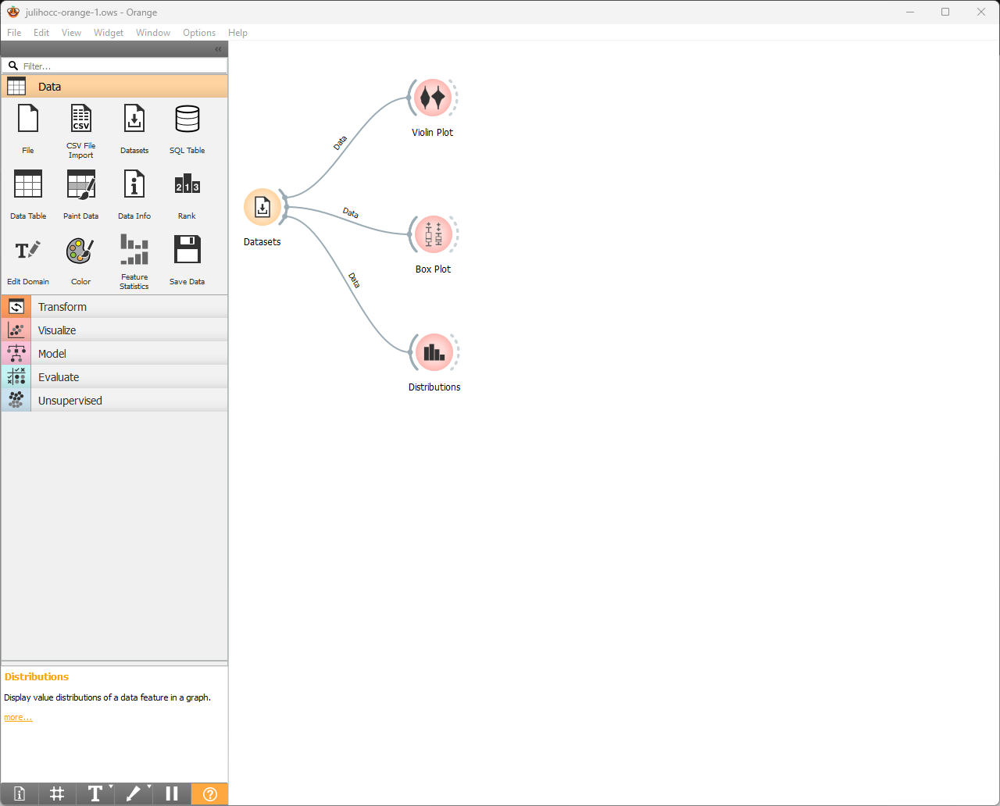
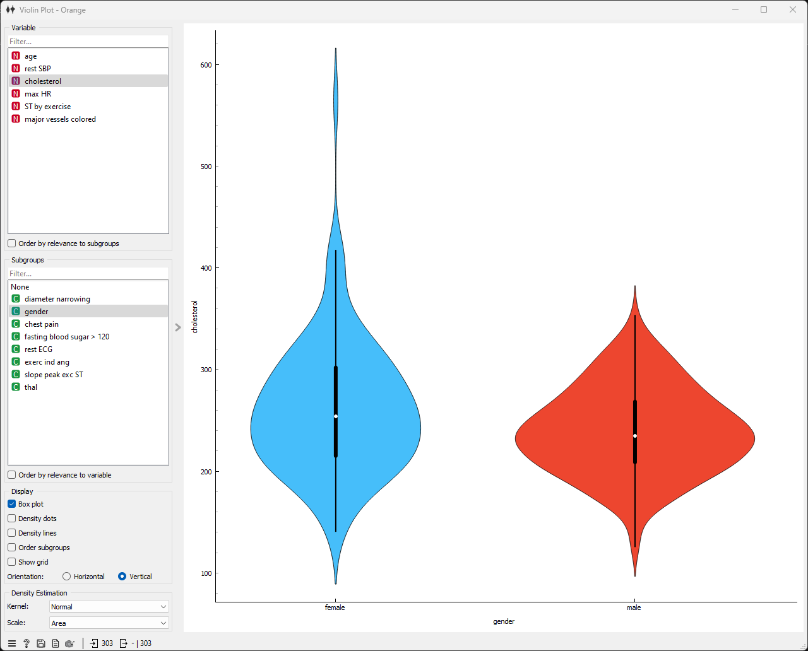
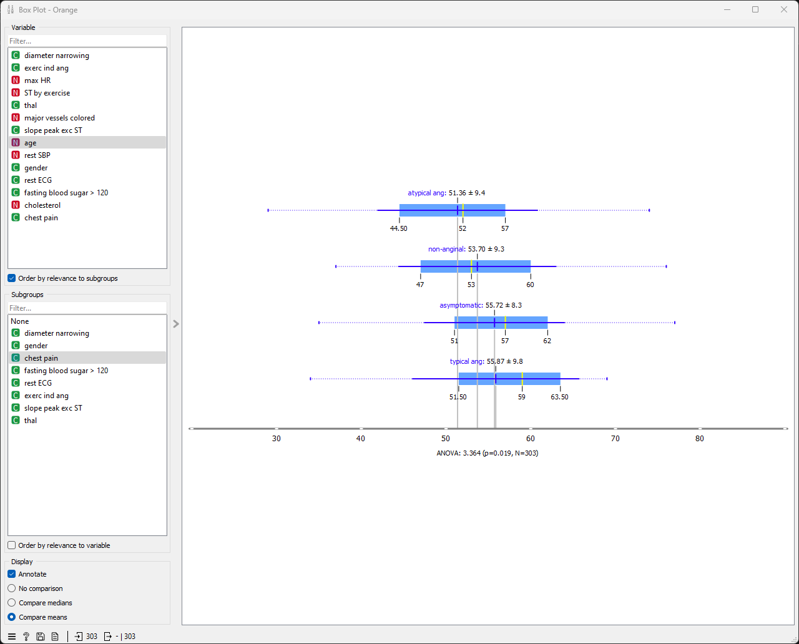
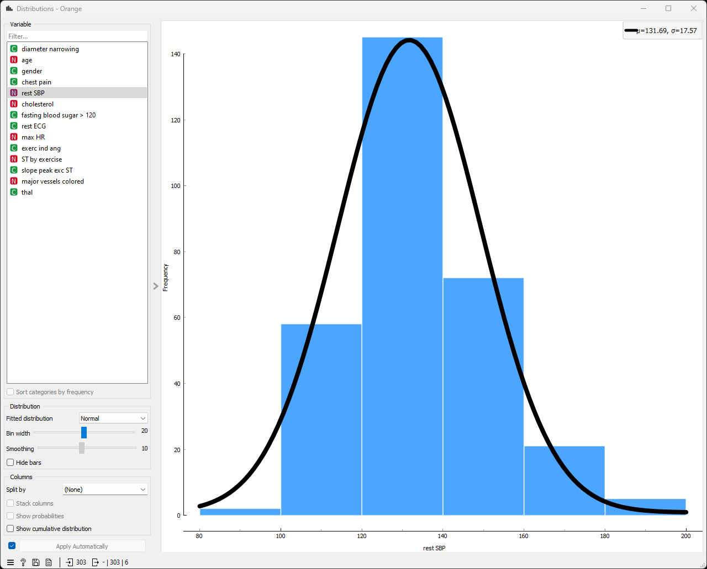

# Primera parte

*Presenta: Juliho David Castillo Colmenares*

**Instrucciones**

1. Lea el caso aplicativo “How To Use The 7 Step BSPF: A Customer Churn Example”
2. Explique con sus palabras de forma breve en qué consisten cada uno de los siete pasos planteados para crear un “Business Science Problem Framework (BSPF)” en este caso.
3. Comente si es aplicable a su entorno laboral y por qué. 

El artículo "How To Use The 7 Step BSPF: A Customer Churn Example" ([https://www.business-science.io/business/2018/06/19/business-science-problem-framework.html](https://www.business-science.io/business/2018/06/19/business-science-problem-framework.html)) presenta un marco metodológico de siete pasos para la definición y resolución de problemas empresariales mediante la aplicación de la ciencia de datos. Estos pasos son los siguientes:

**1. Definición del problema:** En esta etapa inicial se establece el problema empresarial de manera clara y concisa. Esto implica la identificación de los objetivos específicos a alcanzar y la comprensión del contexto en el que se enmarca el problema.

**2. Formulación de una hipótesis:** Se plantea una hipótesis que explique las causas subyacentes del problema. Esta hipótesis debe cumplir con los criterios de especificidad, mensurabilidad, alcanzabilidad, relevancia y temporalidad (SMART).

**3. Recopilación de datos:** Se procede a la recolección de los datos necesarios para evaluar la hipótesis formulada. Estos datos pueden provenir de diversas fuentes, tales como bases de datos internas, encuestas o experimentos diseñados específicamente.

**4. Exploración de datos:** Se realiza un análisis exploratorio de los datos recopilados para comprender su estructura, distribución y patrones relevantes. Esta etapa puede ayudar a identificar variables significativas y posibles sesgos en la información.

**5. Modelado:** Se construye un modelo estadístico que explique la relación entre las variables y el problema empresarial planteado. El tipo de modelo utilizado puede ser un modelo de regresión, un modelo de clasificación o cualquier otro modelo estadístico adecuado.

**6. Evaluación del modelo:** Se evalúa el rendimiento del modelo construido utilizando métricas apropiadas. Estas métricas deben estar alineadas con los objetivos específicos del problema empresarial.

**7. Implementación de la solución:** Si el modelo demuestra un rendimiento satisfactorio, se procede a la implementación de la solución en el contexto empresarial. Esto puede implicar cambios en los procesos, productos o servicios ofrecidos.

## Aplicabilidad en el entorno laboral

La aplicabilidad del BSPF en un entorno laboral específico dependerá de diversos factores, tales como la disponibilidad de datos, la cultura organizacional y las habilidades del equipo de ciencia de datos. En general, el BSPF se presenta como una herramienta valiosa para aquellas empresas que buscan utilizar la ciencia de datos para resolver problemas empresariales de manera efectiva. El marco metodológico proporciona una guía clara y estructurada para el proceso de resolución de problemas, desde la definición inicial del problema hasta la implementación de la solución.

En un entorno laboral como el mío, el BSPF podría ser aplicado a una amplia gama de problemas, como la predicción de la rotación de empleados, la optimización de campañas de marketing o la mejora de la eficiencia operativa. La aplicabilidad específica dependería del acceso a los datos y de las prioridades estratégicas de la empresa.

## Conclusiones

El BSPF se presenta como un marco metodológico útil para la definición y resolución de problemas empresariales mediante la aplicación de la ciencia de datos. Es un enfoque sistemático que puede ayudar a las empresas a tomar decisiones basadas en datos y mejorar sus resultados.

## Referencia

* How To Use The 7 Step BSPF: A Customer Churn Example: [https://www.business-science.io/business/2018/06/19/business-science-problem-framework.html](https://www.business-science.io/business/2018/06/19/business-science-problem-framework.html)

# Segunda Parte

**Instrucciones**

1. Considere la base de datos de muestra “heart_disease.tab“ disponible en Orange.
2. Elabore 3 tipos de gráficos distintos a los vistos en este módulo (disponibles en la sección “Visualize”) aplicando diversas condiciones y comentando sobre el uso práctico que podría darles. 

Para esta tarea, utilizaremos el banco de datos `heart_disease.tab`, disponible en `Orange`. Elaboraremos los siguientes tres gráficos:

- `Violin Plot`, en el que analizaremos el nivel de colesterol, separando a los individuos por genero. 
- `Blox Plot`, en el que analizaremos la distribución de las edades, dependiendo del nivel del dolor pectoral. 
- `Distributions`, en el que analizaremos la presión arterial sistólica en reposo. 

## `Violin Plot`

### Hallazgos clave

- **Distribución general del colesterol:** La distribución general de los niveles de colesterol parece estar ligeramente sesgada hacia la derecha, lo que indica que hay más individuos con niveles de colesterol más altos.
- **Diferencias de género en la distribución del colesterol:** Los gráficos de violín sugieren que puede haber diferencias en la distribución de los niveles de colesterol entre hombres y mujeres. El gráfico de violín femenino parece ser ligeramente más estrecho y simétrico que el gráfico de violín masculino, lo que sugiere que los niveles de colesterol se distribuyen de manera más uniforme entre las mujeres. Además, el nivel de colesterol medio para las mujeres parece ser más bajo que el nivel de colesterol medio para los hombres.
- **Interpretación:** Estos hallazgos sugieren que las mujeres pueden tener niveles de colesterol más bajos en promedio que los hombres. Sin embargo, es importante tener en cuenta que esta es solo una observación de un solo conjunto de datos, y se necesitaría más investigación para confirmar este hallazgo y explorar las causas subyacentes de cualquier diferencia de género en los niveles de colesterol.

### Conclusión

El gráfico de violín en la imagen sugiere que puede haber diferencias en la distribución de los niveles de colesterol entre hombres y mujeres, con las mujeres teniendo niveles de colesterol más bajos en promedio. Sin embargo, es importante tener en cuenta que esta es solo una observación de un solo conjunto de datos, y se necesitaría más investigación para confirmar este hallazgo y explorar las causas subyacentes de cualquier diferencia de género en los niveles de colesterol.

## `Box plot`

### Intepretación de los resultados

De acuerdo a los diagramas de caja, podemos recoger la siguiente información estádistica de la variable `age` (edades), donde las unidades son años. 

| Nivel de dolor  | Media | Des. est. | Primer cuartil | Mediana | Tercer cuartil |
| --------------- | ----- | --------- | -------------- | ------- | -------------- |
| Atípico         | 51.36 | 9.4       | 44.50          | 52      | 57             |
| No anginoso     | 53.70 | 9.3       | 47             | 53      | 60             |
| Asintomático    | 55.72 | 8.3       | 51             | 57      | 62             |
| Anginoso típico | 55.87 | 9.8       | 51.50          | 59      | 63.50          |

Los niveles de dolor tienen las siguientes características

- Asintomático: Las personas asintomáticas no experimentan ninguna molestia o presión en el área torácica
- Anginoso típico: El dolor típico se caracteriza por una opresión o presión incómoda en el centro del pecho, que puede irradiarse a otras áreas como el brazo izquierdo, el hombro, la mandíbula o la espalda.expand_more Este tipo de dolor a menudo se describe como similar a una "sensación de aplastamiento" o una "quemadura".expand_more Suele estar asociado a la angina de pecho, una condición causada por la reducción del flujo sanguíneo al corazón.
- Anginoso atípico: El dolor atípico presenta características que lo diferencian del dolor típico. Puede manifestarse como una molestia o presión menos intensa, un dolor punzante, ardor o incluso una sensación de indigestión. Este tipo de dolor puede ser más difícil de identificar como un problema cardíaco, ya que sus características varían y pueden confundirse con otras afecciones. Sin embargo, es importante no ignorarlo, ya que aún puede indicar un problema cardíaco subyacente.
- Dolor no anginoso: El dolor no anginoso se refiere a cualquier dolor en el pecho que no esté relacionado con la angina de pecho. Puede tener diversas causas, como problemas digestivos, musculares, óseos o incluso ansiedad. 

### Conclusiones estadísticas válidas a partir de los resultados presentados:

Con base en la información proporcionada y los diagramas de caja, podemos extraer las siguientes conclusiones estadísticas válidas:

**1. Diferencias en la edad media según el nivel de dolor:**

- Existe una diferencia estadísticamente significativa en la edad media entre los grupos con **dolor típico** (55.87 años) y **asintomáticos** (55.72 años). El grupo con dolor típico tiende a ser un poco mayor en promedio.
- No se observa una diferencia estadísticamente significativa en la edad media entre los grupos **anginoso atípico** (51.36 años), **no anginoso** (53.70 años) y **asintomático**.

**2. Variabilidad de la edad dentro de cada grupo:**

- El grupo con **dolor típico** presenta la mayor variabilidad en la edad (desviación estándar de 9.85 años), lo que indica que la distribución de las edades en este grupo es más dispersa.
- Los grupos **asintomático** (desviación estándar de 8.35 años) y **no anginoso** (desviación estándar de 9.34 años) muestran una variabilidad similar en la edad.
- El grupo con **dolor atípico** tiene la menor variabilidad en la edad (desviación estándar de 9.44 años).

**3. Superposición en la distribución de las edades:**

- A pesar de las diferencias en la media, existe una superposición considerable en la distribución de las edades entre los grupos. Esto significa que hay individuos en cada grupo que se encuentran dentro del rango de edad de los otros grupos.

**4. Limitaciones de la inferencia:**

- Es importante tener en cuenta que estas conclusiones se basan en un número relativamente pequeño de participantes y no representan necesariamente la población general.
- Se necesitaría un estudio más amplio con una muestra más representativa para confirmar estas tendencias y realizar inferencias más generales.

**5. Consideraciones adicionales:**

- La relación entre la edad y el dolor en el pecho es compleja y puede estar influenciada por diversos factores, como el historial médico, los hábitos de vida y otras comorbilidades.
- Un análisis más profundo que incluya estas variables adicionales podría proporcionar información más precisa sobre la asociación entre la edad y el dolor en el pecho según el nivel de dolor.

**En resumen:**

Los datos presentados sugieren que puede haber una asociación entre la edad y el tipo de dolor en el pecho, con individuos con dolor típico que tienden a ser un poco mayores que aquellos que son asintomáticos. Sin embargo, se necesitan más investigaciones con una muestra más grande y representativa para confirmar esta tendencia y comprender mejor la relación entre estas variables.

## `Distributions`

El gráfico muestra un histograma de la variable "rest SBP" (presión arterial sistólica en reposo) de un conjunto de datos de pacientes con enfermedad cardíaca. El histograma está superpuesto a una curva de distribución normal.

### Análisis estadístico

**Medidas de tendencia central**

La media de la variable "rest SBP" es de 131,69. La mediana no se puede calcular a partir del gráfico. La moda de la variable "rest SBP" se encuentra en el intervalo de 120 a 140.

**Medidas de dispersión**

La desviación estándar de la variable "rest SBP" es de 17,57. El rango de la variable "rest SBP" es de 263,38 (máximo - mínimo).

**Forma de la distribución**

La curva de distribución normal sugiere que la variable "rest SBP" sigue una distribución normal. El histograma confirma esta observación, ya que los valores de la variable se distribuyen de manera simétrica alrededor de la media.

### Interpretación

Los resultados del análisis estadístico sugieren que la variable "rest SBP" sigue una distribución normal. Esto significa que la mayoría de los pacientes tienen una presión arterial sistólica en reposo que se encuentra cerca de la media (131,69 mmHg). Los valores extremos (presión arterial sistólica en reposo muy alta o muy baja) son menos frecuentes.

