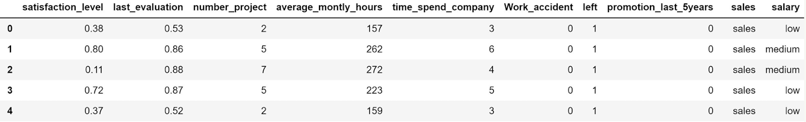

# ¡Bienvenidos a la actividad práctica del módulo! 

**Antes de empezar**

El objetivo de esta actividad es que efectúes un análisis de clasificación KNN que permita desarrollar un modelo predictivo basado en distintas métricas aplicadas a una base de datos grande.

Entregable: Un Jupyter Notebook (archivo de extensión .ipynb), archivo PDF y capturas de pantalla en el espacio de respuesta que muestren tanto el código desarrollado como la solución al problema planteado, incluyendo los comentarios que sean pertinentes a las preguntas que se plantean. Entregas sin estos elementos no serán calificadas.

¡Buena suerte!

**Paso a paso:**

- Considere la base de datos “[recursos_humanos.csv](https://drive.google.com/file/d/1NlY7I_XVgZWCj6A-BJKlL2076WKOyPqc/view?usp=sharing)” sobre empleados que abandonan una empresa.



El objetivo es analizar porqué los empleados deciden irse con la competencia y éste podría ser un desafío serio para un departamento de recursos humanos, el cual se podría abordar mediante modelos predictivos de Machine Learning. Las variables manejadas son: 

    1. satisfaction_level: Nivel de satisfacción. 
    2. last_evaluation: Puntaje obtenido en la ultima evaluación.
    3. average_montly_hours: Promedio de horas trabajadas al mes.
    4. time_spend_company: Tiempo del usuario en la compañía. 
    5. work_accident: Si el empleado ha tenido algún accidente laboral (1 = Sí, 0 = No).
    6. promotion_last_5years: Si el empleado ha sido promovido en los últimos 5 años.
    7. sales: Departamento donde trabaja. 
    8. salary: Categoría del salario. 
    9. left: Variable a predecir y si el empleado dejó o no la empresa (1 = Sí, 0 = No).

- Cargue la base de datos en Python y asegúrese de re-codificar las variables categóricas de manera pertinente antes de iniciar su análisis (Sugerencia: Use “pd.get_dummies”) 
- Mediante un análisis exploratorio de datos determine si esta base de datos está equilibrada o no (de acuerdo a las categorías existentes). 
- Use el método de K Vecinos más cercanos para generar un modelo predictivo. Para dicho fin, determine el valor óptimo de K evaluando distintas alternativas:  k = 1, 2, ...., 20 Asegúrese de respaldar su recomendación de la k óptima en base a una tabla que compare en cada caso las diversas precisiones comentadas en esta lección. 
- Elabore un mapa de calor para la matriz de confusión asociada al valor óptimo de k. Interprete verbalmente cada resultado mostrado en dicha matriz. 
- Obtenga e interprete la gráfica de la curva ROC para el valor óptimo de k. 
- Recuerda guardar el archivo en formato notebook (.ipynb), archivo PDF y capturas de pantalla,
- Titula el archivo como 'Tarea M21-CD – TU NOMBRE'.