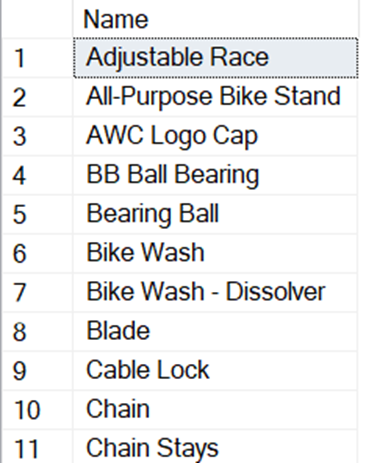

¡Bienvenidos a la actividad práctica del módulo! 

Antes de empezar

Como actividad de este módulo, deberás aplicar las consultas que has aprendido en el módulo.

¡Buena suerte!

Paso a paso:

Usa la base de datos AdventureWorks2022 para completar los siguientes ejercicios. Cada ejercicio se basa en las lecciones que has visto en el curso. Asegúrate de seguir las instrucciones cuidadosamente y aplicar el tipo de unión adecuado para cada caso.

1) Utiliza las tablas HumanResources.Employee y Person.Person para crear una consulta que obtenga los nombres de los empleados (FirstName y LastName) y el título de su puesto (JobTitle) usando un INNER JOIN.

2) Utiliza las tablas Sales.Customer y Person.Person para crear una consulta que obtenga los nombres de los clientes (FirstName y LastName). Asegúrate de incluir todos los clientes, incluso aquellos que no tienen un registro en la tabla Person.Person usando un LEFT JOIN.

3) Utiliza las tablas Sales.SalesOrderHeader y Sales.Customer para crear una consulta que muestre el ID de la orden (SalesOrderID) y el ID del cliente (CustomerID). Asegúrate de incluir todas las órdenes, incluso si no hay un cliente asociado usando un RIGHT JOIN.

4) Utiliza las tablas Production.Product y Production.ProductReview para crear una consulta que muestre el nombre del producto (Name) y el comentario de la reseña (Comments). Incluye todos los productos y todas las reseñas, incluso si no coinciden usando un FULL OUTER JOIN.

5) Utiliza las tablas Production.Product y Production.ProductCategory para crear una consulta que devuelva una combinación de todos los productos con todas las categorías usando un CROSS JOIN.

6) Crea dos consultas: una que utilice UNION y otra que utilice UNION ALL para combinar los nombres de productos de las tablas Production.Product y Production.ProductModel.

7) Utiliza la tabla HumanResources.Employee para crear una consulta que muestre el BusinessEntityID, el JobTitle, y una columna adicional que indique si el título del puesto contiene la palabra 'Manager' usando la expresión CASE. Si el título del puesto es nulo, usa COALESCE para mostrar 'No Title'.

8) Utiliza la tabla Sales.SalesPerson para crear una consulta que muestre el BusinessEntityID, la SalesQuota, y una columna que indique 'No Quota' si SalesQuota es nulo usando la función ISNULL.

9) Recuerda guardar tu script de SQL (archivo .sql) con las respuestas de cada una de las preguntas del ejercicio.

10) Titula el documento como 'Tarea M9 – TU NOMBRE'.

11) Envía tu archivo al tutor a través de la plataforma EBAC.

¿Cómo presentar su entrega?

Un script de SQL (archivo .sql) con las respuestas de cada una de las preguntas del ejercicio.

Tiempo estimado de resolución: 90 minutos.