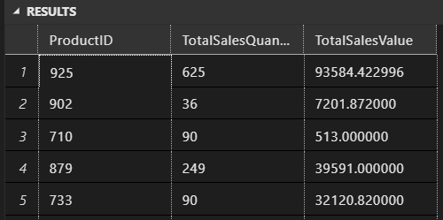
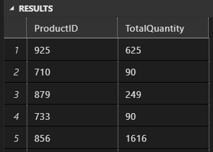
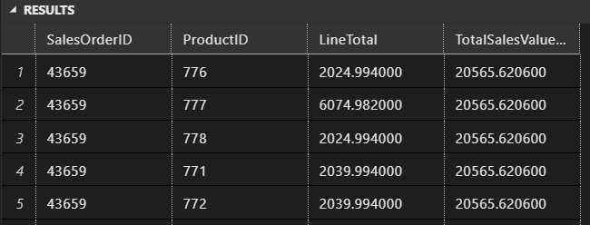
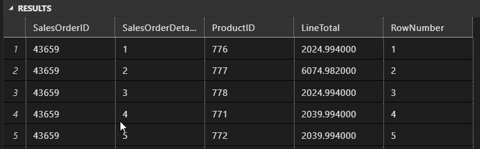
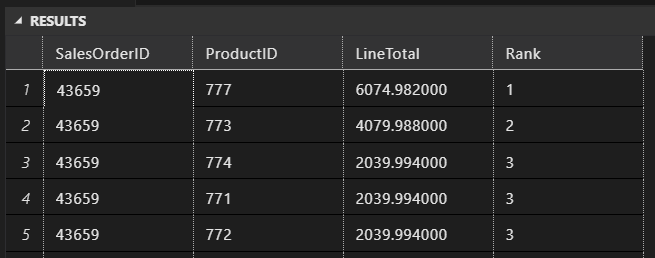
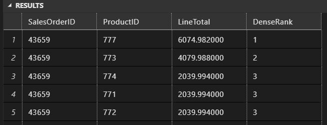
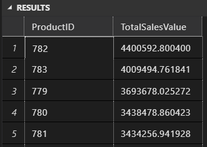

# Agrupación y particionamiento 

*Presenta: Juliho Castillo Colmenares*

**¡Bienvenidos a la actividad práctica del módulo!**

Como actividad de este módulo, deberás aplicar las consultas que has aprendido en el módulo.

¡Buena suerte!

## Paso a paso:

Usa la base de datos `AdventureWorks2022` para completar los siguientes ejercicios. Cada ejercicio se basa en las lecciones que has visto en el curso. Asegúrate de seguir las instrucciones cuidadosamente y aplicar el tipo de unión adecuado para cada caso.

1. **Consulta con GROUP BY:**
   - Utiliza la tabla `Sales.SalesOrderDetail` para crear una consulta que obtenga el `ProductID`, el número total de ventas (`OrderQty`) y el valor total de ventas (`LineTotal`) por cada producto usando la cláusula `GROUP BY`.

   ```sql
   SELECT 
      ProductID, 
      SUM(OrderQty) AS TotalSalesQuantity, 
      SUM(LineTotal) AS TotalSalesValue
   FROM 
      [AdventureWorks2022].[Sales].[SalesOrderDetail]
   GROUP BY 
      ProductID;
   ```
   

2. **Filtrado con HAVING:**
   - Utiliza la tabla `Sales.SalesOrderDetail` para crear una consulta que agrupe los datos por `ProductID` y obtenga el número total de ventas (`OrderQty`) por producto. Filtra los grupos para mostrar solo aquellos productos que han tenido más de 50 ventas usando la cláusula `HAVING`.

   ```sql
   SELECT 
      ProductID, 
      SUM(OrderQty) AS TotalQuantity
   FROM 
      [AdventureWorks2022].[Sales].[SalesOrderDetail]
   GROUP BY 
      ProductID
   HAVING 
      SUM(OrderQty) > 50;
   ```
   

3. **Uso de OVER con PARTITION BY:**
   - Utiliza la tabla `Sales.SalesOrderDetail` para crear una consulta que muestre el `SalesOrderID`, `ProductID`, `LineTotal` y el valor total de ventas (`LineTotal`) para cada `SalesOrderID` usando la cláusula `OVER` con `PARTITION BY`.

   ```sql
   SELECT 
      SalesOrderID, 
      ProductID, 
      LineTotal, 
      SUM(LineTotal) OVER (PARTITION BY SalesOrderID) AS TotalSalesValuePerOrder
   FROM 
      [AdventureWorks2022].[Sales].[SalesOrderDetail];
   ```

   

4. **Numeración con ROW_NUMBER():**
   - Utiliza la tabla `Sales.SalesOrderDetail` para crear una consulta que muestre el `SalesOrderID`, `SalesOrderDetailID`, `ProductID` y `LineTotal`. Usa la función `ROW_NUMBER()` para numerar cada línea de pedido dentro de cada `SalesOrderID`.

   ```sql
   SELECT 
      SalesOrderID, 
      SalesOrderDetailID, 
      ProductID, 
      LineTotal, 
      ROW_NUMBER() OVER (PARTITION BY SalesOrderID ORDER BY SalesOrderDetailID) AS RowNumber
   FROM 
      [AdventureWorks2022].[Sales].[SalesOrderDetail];
   ```

   

5. **Asignación de rangos con RANK():**
   - Utiliza la tabla `Sales.SalesOrderDetail` para crear una consulta que muestre el `SalesOrderID`, `ProductID` y `LineTotal`. Asigna un rango a cada producto dentro de cada `SalesOrderID` basado en el `LineTotal` usando la función `RANK()`.

   ```sql
   -- Utiliza la tabla Sales.SalesOrderDetail para crear una consulta que muestre el SalesOrderID, ProductID y LineTotal. Asigna un rango a cada producto dentro de cada SalesOrderID basado en el LineTotal usando la función RANK().

   SELECT 
      SalesOrderID, 
      ProductID, 
      LineTotal, 
      RANK() OVER (PARTITION BY SalesOrderID ORDER BY LineTotal DESC) AS Rank
   FROM 
      [AdventureWorks2022].[Sales].[SalesOrderDetail];
   ```

   

6. **Asignación de rangos con DENSE_RANK():**
   - Utiliza la tabla `Sales.SalesOrderDetail` para crear una consulta que muestre el `SalesOrderID`, `ProductID` y `LineTotal`. Asigna un rango denso a cada producto dentro de cada `SalesOrderID` basado en el `LineTotal` usando la función `DENSE_RANK()`.

   ```sql
   -- Utiliza la tabla Sales.SalesOrderDetail para crear una consulta que muestre el SalesOrderID, ProductID y LineTotal. Asigna un rango denso a cada producto dentro de cada SalesOrderID basado en el LineTotal usando la función DENSE_RANK().

   SELECT 
      SalesOrderID, 
      ProductID, 
      LineTotal, 
      DENSE_RANK() OVER (PARTITION BY SalesOrderID ORDER BY LineTotal DESC) AS DenseRank
   FROM 
      [AdventureWorks2022].[Sales].[SalesOrderDetail];
   ```

   

7. **Filtrado con HAVING y ordenación:**
   - Utiliza la tabla `Sales.SalesOrderDetail` para crear una consulta que agrupe los datos por `ProductID` y obtenga el valor total de ventas (`LineTotal`). Filtra para mostrar solo aquellos productos con un valor total de ventas superior a $5000 usando la cláusula `HAVING`. Ordena los resultados por el valor total de ventas en orden descendente.

   ```sql
   SELECT 
      ProductID, 
      SUM(LineTotal) AS TotalSalesValue
   FROM 
      [AdventureWorks2022].[Sales].[SalesOrderDetail]
   GROUP BY 
      ProductID
   HAVING 
      SUM(LineTotal) > 5000
   ORDER BY 
      TotalSalesValue DESC;
   ```

   
