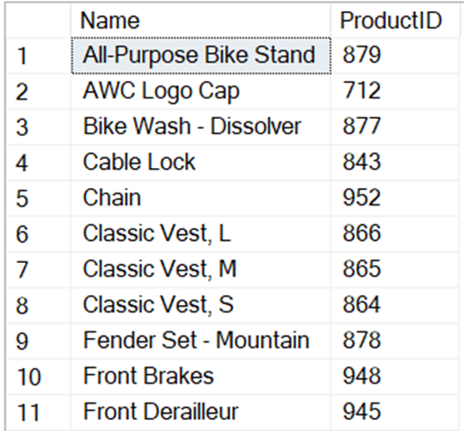
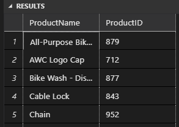
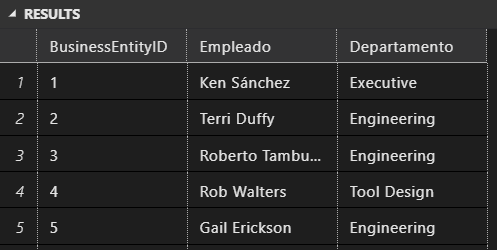

# SQL Avanazado
Presenta: Juliho Castillo Colmenares

Usa la base de datos AdventureWorks2022 para completar los siguientes ejercicios. Cada ejercicio se basa en las lecciones que has visto en el curso. Asegúrate de seguir las instrucciones cuidadosamente y aplicar el tipo de unión adecuado para cada caso.

1. Utiliza la tabla Production.Product para crear una consulta que muestre los nombres de los productos y los ID’s de productos que hayan sido ordenados. Utiliza una subconsulta para filtrar los productos ordenados en la tabla Sales.SalesOrderDetail. Ordena el resultado por nombre de manera ascendente.

    

    ```sql
    -- Utiliza la tabla Production.Product para crear una consulta que muestre los nombres de los productos y los ID’s de productos que hayan sido ordenados. Utiliza una subconsulta para filtrar los productos ordenados en la tabla Sales.SalesOrderDetail. Ordena el resultado por nombre de manera ascendente.

    SELECT 
        p.Name AS ProductName,
        p.ProductID
    FROM 
        [AdventureWorks2022].[Production].[Product] p
    WHERE 
        p.ProductID IN (SELECT sod.ProductID FROM [AdventureWorks2022].[Sales].[SalesOrderDetail] sod)
    ORDER BY 
        p.Name ASC;
    ```

    

2. Utiliza las tablas HumanResources.Employee, HumanResources.EmployeeDepartmentHistory, HumanResources.Department y Person.Person para crear una consulta que muestre un listado de todos los empleados y el nombre de su departamento actual. Los campos a mostrar serán: BusinessEntityID, FirstName + ' ' + LastName como Nombre del Empleado, y Name como Nombre del Departamento.

    

    ```sql
    -- Utiliza las tablas HumanResources.Employee, HumanResources.EmployeeDepartmentHistory, HumanResources.Department y Person.Person para crear una consulta que muestre un listado de todos los empleados y el nombre de su departamento actual. Los campos a mostrar serán: BusinessEntityID, FirstName + ' ' + LastName como Nombre del Empleado, y Name como Nombre del Departamento.

    SELECT 
        e.BusinessEntityID,
        p.FirstName + ' ' + p.LastName AS Empleado,
        d.Name AS Departamento
    FROM 
        [AdventureWorks2022].[HumanResources].[Employee] e
    JOIN 
        [AdventureWorks2022].[Person].[Person] p ON e.BusinessEntityID = p.BusinessEntityID
    JOIN 
        [AdventureWorks2022].[HumanResources].[EmployeeDepartmentHistory] edh ON e.BusinessEntityID = edh.BusinessEntityID
    JOIN 
        [AdventureWorks2022].[HumanResources].[Department] d ON edh.DepartmentID = d.DepartmentID
    WHERE 
        edh.EndDate IS NULL
    ORDER BY 
        e.BusinessEntityID ASC;
    ```

    


3.Utiliza las tablas HumanResources.Employee, HumanResources.EmployeeDepartmentHistory y HumanResources.Department para crear una consulta que muestre el mismo resultado que en el ejercicio 2, pero utilizando un CTE. Los campos a mostrar serán: BusinessEntityID, FirstName + ' ' + LastName como Nombre del Empleado, y Name como Nombre del Departamento.

4.Crea una tabla temporal local y otra global para almacenar los productos ordenados. Utiliza la tabla Production.Product para insertar los datos en ambas tablas temporales. Los campos a incluir serán: ProductID y Name. Inserta los datos en la tabla temporal local.


5.Utiliza la tabla Sales.SalesOrderHeader para crear una consulta que muestre los números de orden y números de compra solo para el año 2011.


6.Utiliza la tabla Sales.SalesOrderHeader para crear una consulta que muestre los números de orden y números de compra sin los 2 primeros caracteres y nombra los campos resultantes como NewSalesOrderNumber y NewPurchaseOrderNumber.


7.Recuerda guardar tu script de SQL (archivo .sql) con las respuestas de cada una de las preguntas del ejercicio.

8.Titula el documento como 'Tarea M11 – TU NOMBRE'.

9.Envía tu archivo al tutor a través de la plataforma EBAC.

¿Cómo presentar su entrega?

Script de SQL (archivo .sql) con las respuestas de cada una de las preguntas del ejercicio.

Tiempo estimado de resolución: 90 min.