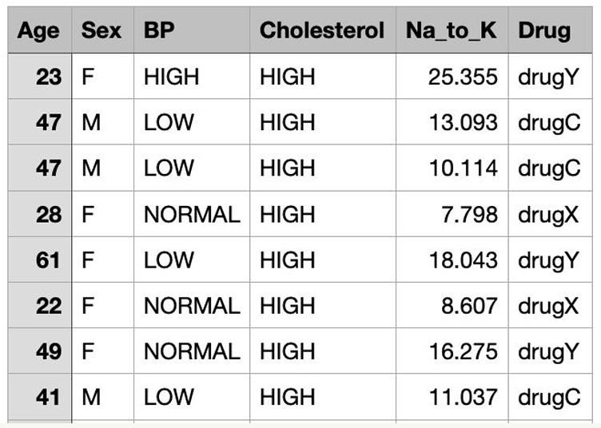
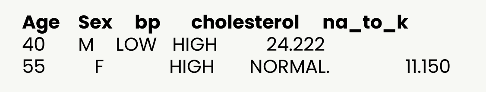

## Instrucciones

- Explique las diferencias de trabajar un proyecto de manera tradicional vs realizarlo de manera ágil. A continuación, ejemplifique mediante un caso real de un proyecto de Ciencia de Datos. ¿Qué ventajas presenta el trabajar de la segunda manera? ¿Cuáles serían las desventajas potenciales que podría tener? 

- Imagina que eres un investigador médico que recopila datos para un estudio. Has recopilado datos sobre un conjunto de pacientes, todos ellos con la misma enfermedad. Durante su tratamiento, cada paciente ha respondido a uno de los 5 medicamentos, el fármaco A, el fármaco B, el fármaco C (de proveedor nacional), el fármaco X y el Y (de proveedor extranjero).

- Tu trabajo consistirá en construir un modelo mediante Orange que permita averiguar cual medicamento podría ser apropiado para un futuro paciente con la misma enfermedad.

  

- Elabore un reporte detallado (a manera de proyecto final del módulo) que muestre los hallazgos obtenidos con la finalidad de encontrar el modelo que hace la mejor predicción de todos los que se encuentran disponibles en Orange.
- Recuerda que para ello deberás probar diversas combinaciones de parámetros de manera que vayas mejorando la exactitud.
- Por esto se recomienda que tu estudio incluye apartados para cada metodología empleada donde se comparen diversas calibraciones. Una vez establecido el modelo recomendado, úsalo para predecir los siguientes casos (interpretando verbalmente sus resultados):

