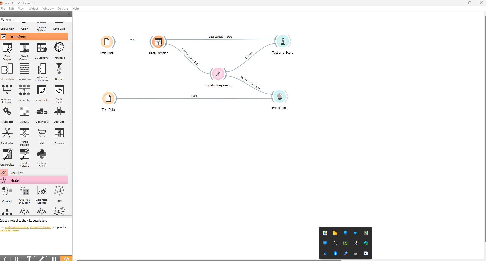
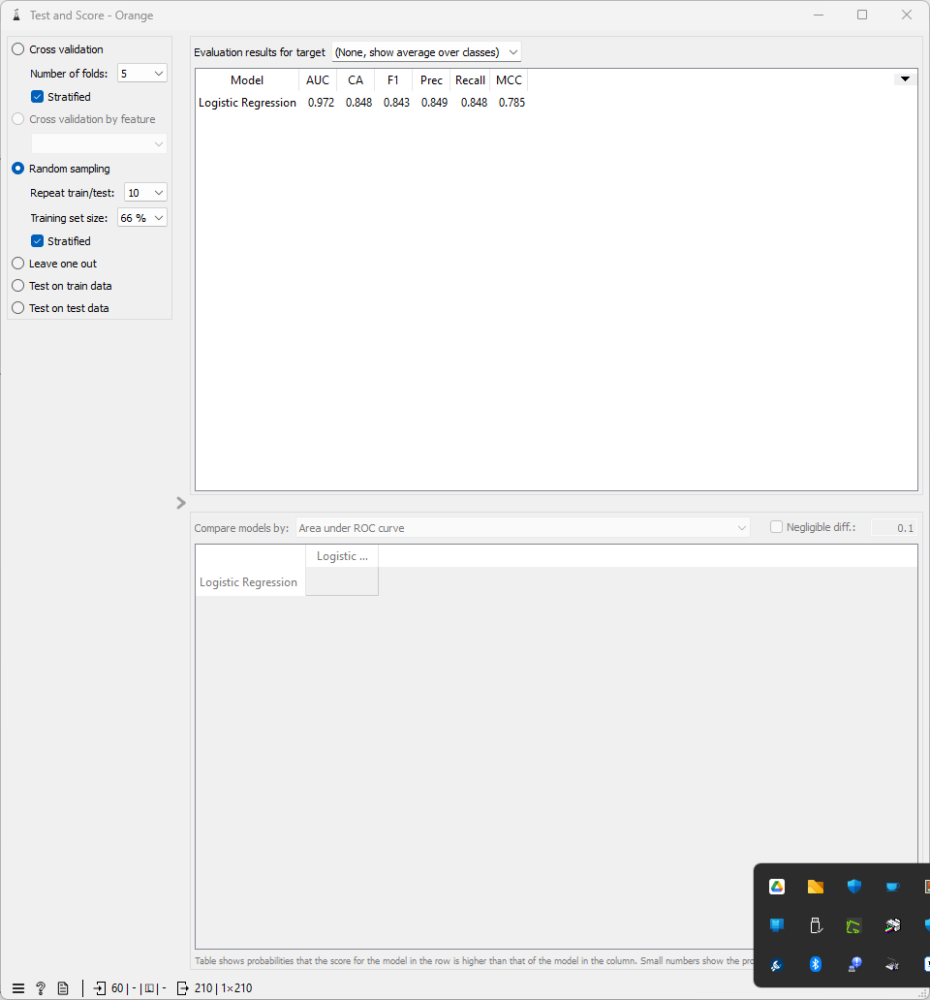
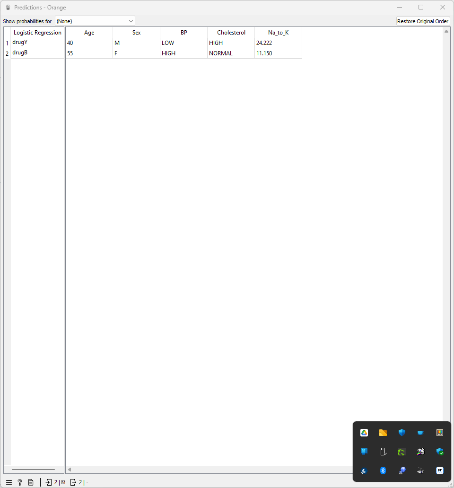
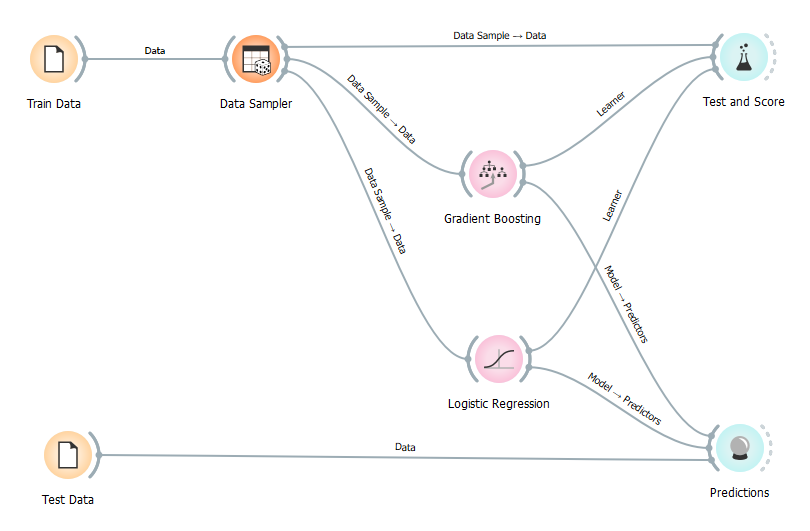
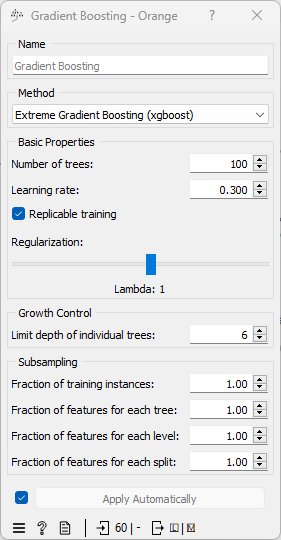
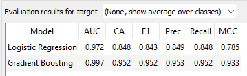

# Semana 20

**Presenta: Juliho David Castillo Colmenares**

## Parte 1 

En el ámbito de la Ciencia de Datos, la elección entre una gestión de proyectos tradicional y una ágil puede tener un impacto significativo en la eficiencia, efectividad y adaptabilidad del proyecto. A continuación, se detallan las diferencias clave entre estos dos enfoques y se discute un caso real para ilustrar las ventajas y desventajas de la metodología ágil.

### Diferencias entre Gestión Tradicional y Ágil

1. **Planificación y Ejecución:**
   - **Tradicional:** La gestión tradicional requiere una planificación exhaustiva y detallada antes de iniciar cualquier fase de ejecución. Las etapas del proyecto están claramente definidas y deben seguirse secuencialmente, lo que puede limitar la flexibilidad para adaptarse a cambios o nuevos hallazgos.
   - **Ágil:** La metodología ágil es iterativa e incremental, lo que permite adaptaciones frecuentes al alcance del proyecto basadas en el feedback y los resultados de sprints anteriores. Esta flexibilidad es esencial en proyectos donde los datos pueden revelar nuevas oportunidades o desafíos inesperados.

2. **Colaboración y Comunicación:**
   - **Tradicional:** La comunicación suele ser más formal y a menudo filtrada a través de niveles jerárquicos, lo que puede ralentizar la toma de decisiones y la respuesta a los problemas.
   - **Ágil:** Promueve una comunicación abierta y constante dentro del equipo y con los stakeholders, facilitando un entendimiento compartido del progreso y los desafíos del proyecto.

### Caso Real: Análisis Predictivo en el Sector Salud

Un ejemplo claro de la aplicación de la metodología ágil en Ciencia de Datos es el desarrollo de modelos predictivos para la identificación temprana de enfermedades crónicas en una red de hospitales. En este proyecto, el equipo utilizó técnicas de machine learning para analizar grandes volúmenes de datos clínicos y demográficos.

- **Enfoque Ágil:** El proyecto se ejecutó en sprints de dos semanas, al final de cada uno se revisaban los modelos con médicos y especialistas. Esto permitió ajustar rápidamente los modelos en función de la precisión deseada y las necesidades clínicas, una flexibilidad que un enfoque tradicional no podría haber ofrecido de manera eficiente.

### Ventajas de la Gestión Ágil

- **Adaptabilidad:** La capacidad de ajustar el proyecto a medida que emergen nuevos datos y tecnologías.
- **Innovación Continua:** Fomenta la experimentación y la validación rápida de ideas, lo que es crucial en campos en rápida evolución como la Ciencia de Datos.
- **Satisfacción del Cliente:** Al integrar continuamente el feedback de los usuarios finales (en este caso, médicos), el producto final es más relevante y útil.

### Desventajas Potenciales

- **Falta de Estructura:** Puede ser desafiante para equipos acostumbrados a una guía y marcos de trabajo más definidos.
- **Sobrecarga de Reuniones:** Las reuniones frecuentes y revisiones de sprint pueden ser percibidas como distracciones, especialmente si no están bien gestionadas.

En conclusión, aunque la gestión ágil ofrece numerosas ventajas, especialmente en proyectos dinámicos como los de Ciencia de Datos, es esencial gestionar cuidadosamente aspectos como la estructura del equipo y la comunicación para maximizar su eficacia.

## Parte 2 

Para la predicción de los resultados, utilizaremos el siguiente flujo de trabajo

### Entrenamiento del modelo

1. Cargamos los datos del archivo `drugs.csv` como`Train Data`. 
2. Utilizamo `Data Sampler` para obtener un muestreo del 70% de los datos
3. Calibramos una regresión logística con el widget `Logistic Regressión`
4. Finalmente, alimentamos el widget `Test and Score`

### **Resultados de la regresión logística**

En la imagen que has proporcionado, se muestran los resultados de una regresión logística realizada con Scikit-Learn.

**Los resultados se resumen en la siguiente tabla:**

| Métrico            | Valor               |
| ------------------ | ------------------- |
| Número de pliegues | 5                   |
| Modelo             | Regresión logística |
| AUC                | 0.972               |
| CA                 | 0.848               |
| F1                 | 0.843               |
| Prec               | 0.849               |
| Recall             | 0.848               |
| MCC                | 0.785               |

**Explicación de los resultados:**

- **Número de pliegues:** El número de pliegues es el número de veces que se divide el conjunto de datos en conjuntos de entrenamiento y prueba. En este caso, el conjunto de datos se dividió en 5 pliegues.
- **Modelo:** El modelo utilizado para la regresión logística es la regresión logística.
- **AUC:** El AUC (área bajo la curva ROC) es una medida del rendimiento del modelo. Un AUC de 1.0 indica que el modelo es perfecto, mientras que un AUC de 0.5 indica que el modelo no es mejor que aleatorio. En este caso, el AUC de 0.972 indica que el modelo tiene un buen rendimiento.
- **CA:** La CA (acidez) es la proporción de predicciones correctas realizadas por el modelo. En este caso, la CA de 0.848 indica que el modelo predice correctamente el 84.8% de los casos.
- **F1:** La F1 es una medida del equilibrio entre la precisión y la recuperación. Una F1 de 1.0 indica que el modelo es perfecto, mientras que una F1 de 0.0 indica que el modelo no es mejor que aleatorio. En este caso, la F1 de 0.843 indica que el modelo tiene un buen equilibrio entre precisión y recuperación.
- **Prec:** La Prec (precisión) es la proporción de casos positivos predichos por el modelo que realmente son positivos. En este caso, la Prec de 0.849 indica que el 84.9% de los casos positivos predichos por el modelo son realmente positivos.
- **Recall:** El Recall (recuperación) es la proporción de casos positivos reales que son predichos correctamente por el modelo. En este caso, el Recall de 0.848 indica que el modelo predice correctamente el 84.8% de los casos positivos reales.
- **MCC:** El MCC (coeficiente de correlación de Matthews) es una medida del rendimiento del modelo que tiene en cuenta tanto la precisión como la recuperación. Un MCC de 1.0 indica que el modelo es perfecto, mientras que un MCC de -1.0 indica que el modelo es totalmente incorrecto. En este caso, el MCC de 0.785 indica que el modelo tiene un buen rendimiento.

**En general, los resultados de la regresión logística son buenos.** El modelo tiene un alto AUC, CA, F1, Prec y Recall, y un MCC moderado. Esto indica que el modelo es capaz de predecir correctamente la clase de los casos con un alto grado de precisión.

### Predicción

1. Se guardaron los datos proporcionados para la regresión en un archivo csv y se cargo como `Test Data`. 
2. Se alimenta el widget `Predictions` con el modelo de regresión logística y los datos de prueba. 
3. Se obtienen los siguientes resultados: 
   1. Para el primer paciente, se recomienda el medicamento `Y`.
   2. Para la segunda paciente, se recomienda el medicamento `B`.

### Mejora de los resultados

Siguiente el mismo flujo, añadimos un modelo `Gradient Boosting`.

Se obtienen los siguiente resultados 

Esto nos muestra que el modelo `Gradiente Boosting` obtiene mejores resultados métrica por métrica. Sin embargo, los resultados esperados son los mismos. 

